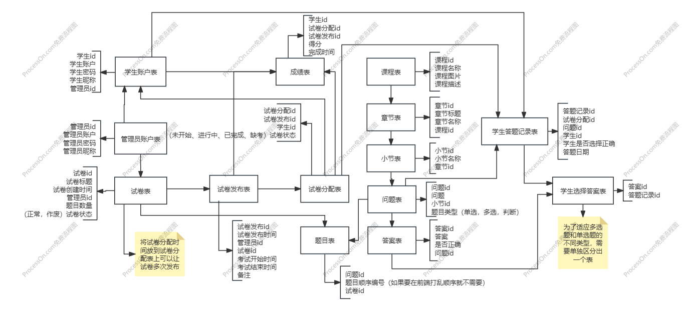
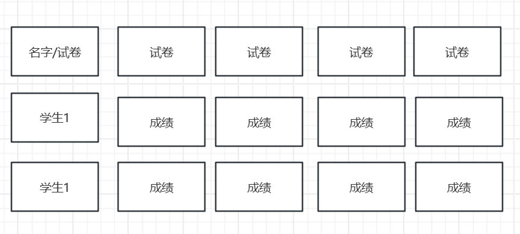

# 考试系统文档

## 需求

#### 客户

1. 客户端注册
2. 客户端登录
3. 客户端考试
4. 查看考试记录
5. 查看考试详细信息

#### 管理

1. 管理员添加数据
    1. 导入固定格式的excel表格读取数据0
    2. 手动选择课程小节添加数据
2. 管理员创建试卷
3. 管理员发布考试试卷（选择固定时间段）
4. 查看学生考试成绩/信息
5. 导出学生统计成绩（excel文件，可选择某一次考试）

#### 数据

1. 初始数据部分从api接口获取
2. 管理员可以添加数据
3. 后期添加ai出题

## 数据库设计

# 客户端

* 首页
  * 展示：
    * 答题数
    * 错题数
    * 最近得分
    * 平均分
  * 待考试
    * 还未开始的试卷列表，如果有就显示红点
  * 考试中
    * 考试中的试卷列表，如果有就显示个红点
  * 已考完
    * 已考完的试卷列表
* 错题集
  * 错题列表
* 收藏
* 设置
  * 修改账号/密码/昵称

# 管理端

* 首页
  * 展示
    * 学生数量
    * 课程数量
    * 题目数量

* 数据管理

  * 题目管理
    * 展示
      * 分页展示题目和答案：根据，`课程/章节/小节/题目内容/题目类型` 进行搜索
      * 可以对题目和答案进行修改删除和手动添加
  * 题目导入
    * 通过固定格式的exel表格自动存入库中

  * 课程管理
    * 展示课程列表
      * 右边显示修改和删除
      * 点击可以进入章节
        * 同上，点击后进入小节
          * 点就后进入问题
            * 点击后进入答案

* 学生管理

  * 学生账号信息

  * 学生成绩

    * 展示
      * 默认分页展示最近的几条学生的考试成绩
      * 可以根据`学生、课程、试卷、试卷状态进行筛选`

    * 点击学生的信息可以查看错题记录

  * 学生成绩统计

    * 展示学生的每次考试成绩
      * 左边栏展示考试记录（可以进行多选，只展示选中的数据）
      * 左边栏展示考试学生（可以进行多选，只展示选中的数据）
      * 右边展示学生的成绩，
    * 

* 试卷管理

  * 试卷列表：
    * 展示：
      * 分页展示已经有的试卷
        * 点击可以查看其中的题目
        * 可以将试卷作废（如果有发布还未开始的就将发布和分配未开始的记录删除掉）
        * 发布：点击发布，转到选择分配学生的页面
      * 可以根据试卷名称进行搜索
  * 试卷发布：
    * 展示：
      * 展示试卷发布的记录（搜索：试卷名，筛选：未开始、进行中、已完成）
    * 发布考试：
      * 选择已经创建好的试卷，点击发布，转到选择分配学生的页面（设置考试的时间）
        * 在选择完需要发布的学生后点击发布