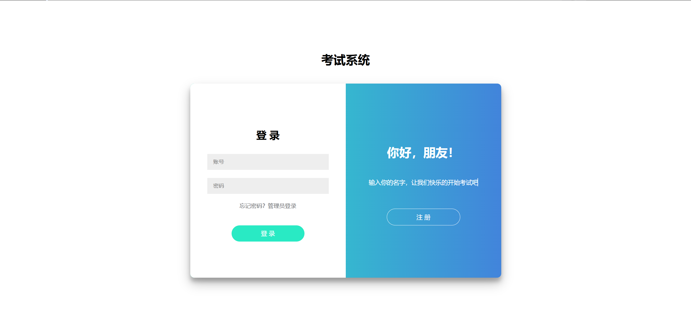
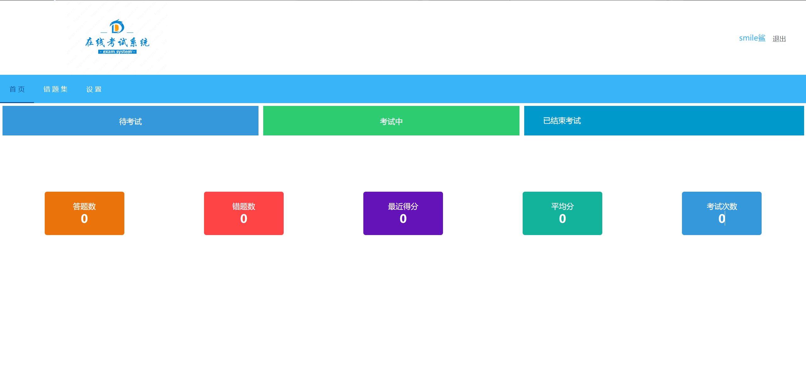
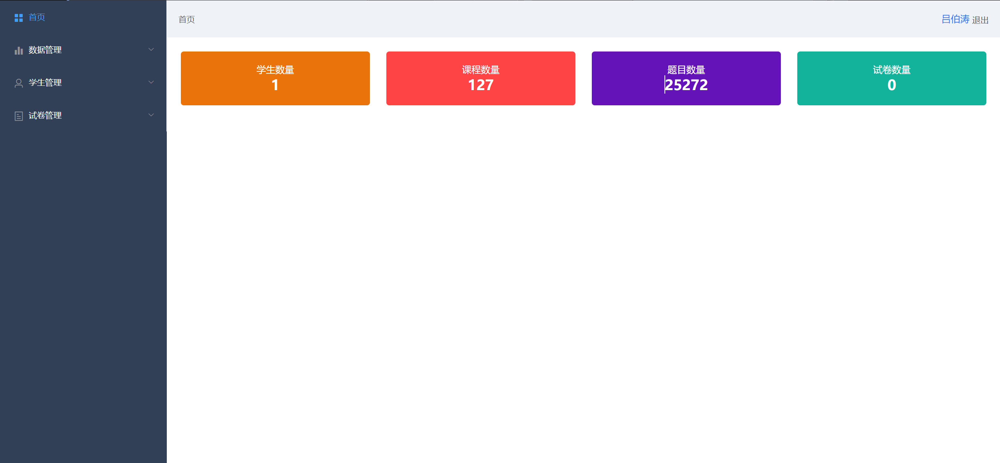
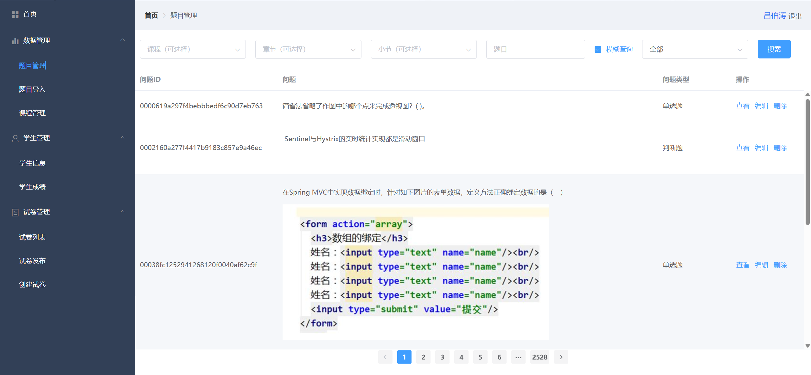
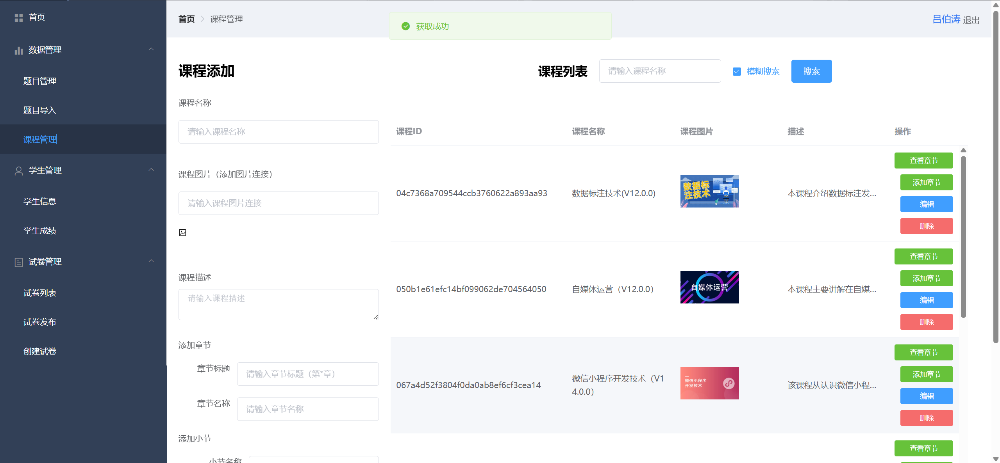

# 考试系统

      

## 数据库设计


# 界面展示

### 学生登录界面



### 学生首页



### 管理端首页



### 题目管理



### 题目导入


### 课程管理



其他的就不展示了

## 业务介绍

#### 客户端

客户端注册：用户可以通过填写必要的注册信息（如用户名、密码、邮箱等）来创建个人账户，完成注册后即可成为系统的正式用户，享受系统提供的各项服务。

客户端登录：用户输入注册时的用户名和密码进行登录，系统会对用户身份进行验证，验证通过后，用户即可进入系统，开始使用考试及其他相关功能。

客户端考试：用户登录后，可以选择参加系统提供的各类考试。考试过程中，系统会根据预设的考试规则和题库随机生成试卷，用户在规定时间内完成答题，系统自动计分并给出考试结果。

查看个人数据：用户可以查看自己的个人信息，包括但不限于用户名、注册邮箱、联系方式等基础信息，以及考试成绩、答题记录等与考试相关的数据，方便用户了解自己的学习进度和考试情况。

查看考试记录：系统会记录用户参加的每一次考试的相关信息，如考试时间、考试科目、考试成绩等。用户可以随时查看自己的考试记录，回顾自己的考试历程，分析考试成绩的变化趋势，为后续的学习和考试提供参考。

查看考试详细信息：用户可以查看每一场考试的详细信息，包括考试的题目、题型、分值分布、答题时间等。对于已经完成的考试，用户还可以查看自己的答题情况，如每道题的得分、答题时间、正确答案与自己的答案对比等，帮助用户深入分析自己的答题情况，找出自己的薄弱环节。

查看错题：系统会自动收集用户在考试过程中答错的题目，并生成错题集。用户可以方便地查看自己的错题，系统还会提供错题的详细解析，帮助用户理解错误原因，加深对知识点的理解，避免在以后的考试中再犯同样的错误。

回顾考试：用户可以回顾自己已经完成的考试，包括考试的题目、自己的答题情况、考试成绩等。通过回顾考试，用户可以总结经验教训，加深对知识点的理解和记忆，为下一次的考试做好准备。

#### 管理端

题目管理：支持手动管理题目、答案信息。

题目导入：支持从 Excel 文件批量导入题目，快速扩充题库。

课程管理：管理员可创建新课程，设置课程名称、描述等信息。对已创建课程进行信息修改和更新，适应课程调整需求。

学生信息：集中管理学生基本信息，包括姓名、学号、班级等，便于统一查看和维护。

学生成绩：管理员可查看学生成绩，支持按班级、科目等条件筛选，快速定位成绩数据。将学生成绩导出为 Excel 文件，方便进行线下分析和存档。

试卷列表：展示所有试卷信息，包括试卷名称、创建时间、适用课程等，方便管理员快速查找和管理试卷。

试卷发布：将创建好的试卷发布给指定的学生群体，设置考试时间、时长等参数，开启考试流程。

创建试卷：管理员可手动创建试卷，从题库中选择题目，设置试卷结构和分值，生成符合教学需求的试卷。


## 项目部署说明

1. **拉取项目**：

   - 克隆项目代码到本地，并进入 `exam-system` 文件夹。

     bash复制

     ```bash
     git clone [项目仓库地址]
     cd exam-system
     ```

2. **添加数据库文件**：

   - 项目中未包含数据库文件，需手动将 `exam_system.sql` 文件放置于 `./docker-project/sql/` 目录下。

3. **启动项目**：

   - 使用 Docker Compose 启动项目。

     bash复制

     ```bash
     docker-compose up -d
     ```

4. **网络配置**：

   - 项目使用 `smileshark` 网络，确保所有服务连接到该网络。

5. **服务端口映射**：

   - **前端服务**（`nginx`）：
     - 映射外部端口 `8887` 到容器内部的 `80` 端口。
     - 配置 `Nginx` 代理 `/api/` 到后端服务 `exam-system:8080`。
   - **后端服务**（`exam-system`）：
     - 映射外部端口 `8081` 到容器内部的 `8080` 端口。

6. **数据库连接**：

   - 后端服务连接 `MySQL` 数据库的配置如下：

     ```properties
     spring.datasource.url=jdbc:mysql://mysql-school-question:3306/exam_system?useSSL=false&serverTimezone=UTC&characterEncoding=utf8&allowPublicKeyRetrieval=true
     spring.datasource.username=smileshark
     spring.datasource.password=smileshark123456
     ```